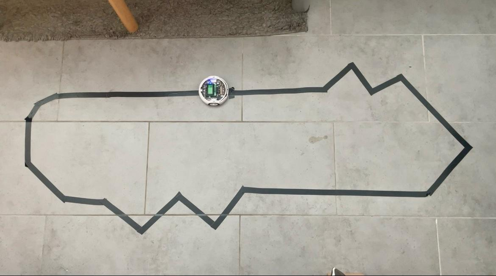

# Labyrinth Roboter

## Overview
In this Project, the 3pi+ robot will follow a black line on a white background. The track contains an intersection, a gap and an offset. The goal is to overcome these obstacles and complete a lap as quickly as possible. The competition consists of three laps, with the best time being counted. A lap is only valid if all obstacles have been successfully passed and the entire track has been completed from start to finish.

### Picture

## Videos for testing PID control parameters
- Link : https://www.youtube.com/playlist?list=PLZY6uj_Yj1aJA992kvDltguuDpu4LGfQ-